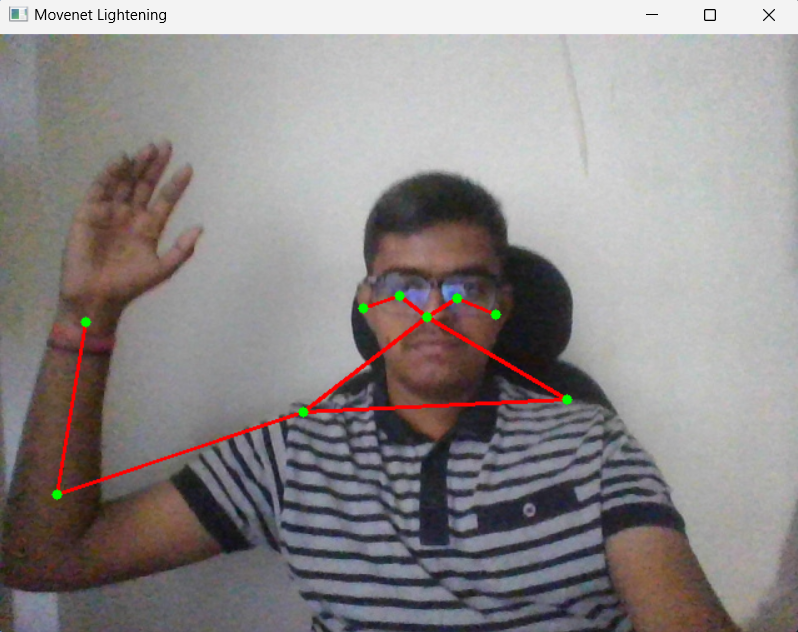
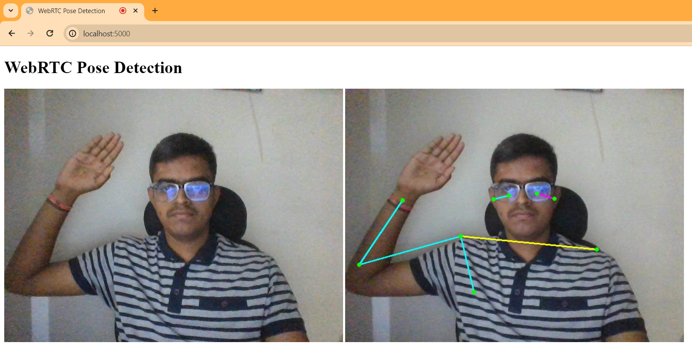
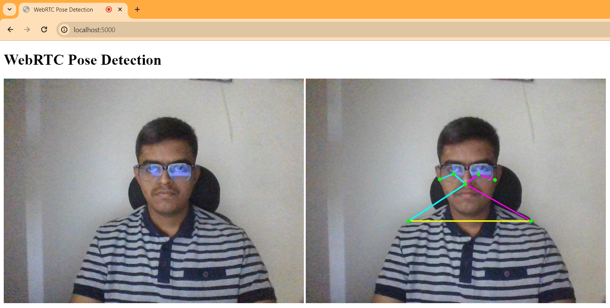

# Movenet-Task

## Task Instructions
The file `instructions.txt` contains the provided instructions.

## Pose Detection with MoveNet Lightning
This repository contains code for performing real-time pose detection using the MoveNet Lightning model. The project includes basic programs, a Tkinter application, and a sockets application for displaying the pose detection results.

### Basic Programs
The "basic programs" folder contains foundational code (both ".py" and ".ipynb" format) for pose detection. This includes scripts to capture frames from live webcam (using OpenCV) and perform pose estimation using the MoveNet Lightning model.



#### Model Source
The source of the MoveNet Lightning model `4.tflite` used in this project is given below. It provides information about the inputs, outputs, and keypoint definitions.

    - [MoveNet Lightning Model](https://www.kaggle.com/models/google/movenet/tfLite/singlepose-lightning-tflite-float16)

### Tkinter Application
The "Tkinter Application" directory hosts a Tkinter-based GUI application for pose detection. It allows users to set the confidence threshold within the window and displays the pose detection results in real-time.

#### Usage
To run the Tkinter application, execute the script `tkinter_pose_detection.py`. Adjust the confidence threshold using the provided input field. The application will display the pose detection output on the live video feed.
    
    - To run the script:
        
    ```bash
        cd "Tkinter Application"
        python tkinter_pose_detection.py
    ```


### Sockets Application
The "Sockets Application" directory contains code for displaying pose detection results on the web using a socket to communicate with the Python server.

#### Usage
1. Run the Python server using the command `python server.py`.
2. Open a web browser and navigate to the specified URL to view the pose detection predictions.
    
    - URL: [http://localhost:5000](http://localhost:5000)



